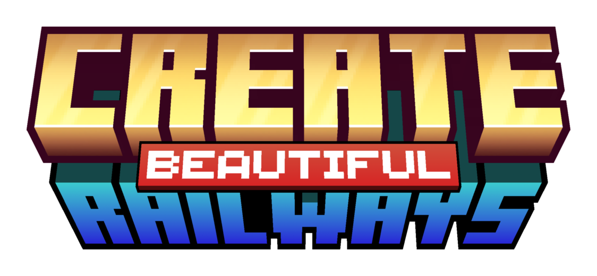

<!-- vale off -->

#   Create: Memorable Railways

A modpack centered around creating beautiful railway networks in your worlds

## About

Utilize [Create](https://modrinth.com/mod/LNytGWDc)'s great train system with the enhancement of other mods such as:

- [Create Railways Navigator](https://modrinth.com/mod/Dq3STxps) by MrJulsen
- [Create: Threaded Trains](https://modrinth.com/mod/RYJzdkDr) by MrJulsen
- [Create Train Physics](https://modrinth.com/mod/5nYnKExR) by Szedann
- [Create Unlimited](https://modrinth.com/mod/jyG2CDff) by rdh

And expand your decoration possibilities with:

- [Amendments](https://modrinth.com/mod/6iTJugQR) by MehVahdJukaar, Plantkillable
- [Another Furniture](https://modrinth.com/mod/ulloLmqG) by Starfish Studios, Crispytwig, Synthestra
- [Chipped](https://modrinth.com/mod/BAscRYKm) by Alex Nijjar, Grimbop, Kekie6, ThatGravyBoat
- [Comforts](https://modrinth.com/mod/SaCpeal4) by Illusive Soulworks
- [Create: Bells & Whistles](https://modrinth.com/mod/gJ5afkVv) by lev
- [Create Bits 'n' Bobs](https://modrinth.com/mod/T8bvmqVZ) by Cake, Kipti, NormalGuy, Astral, Spydnel
- [Create: Copycats\+](https://modrinth.com/mod/UT2M39wf) by Lysine, Bennyboy1695, Redcat_XVIII
- [Create Deco](https://modrinth.com/mod/sMvUb4Rb) by Kayla, Talrey, Ordana, Cassian
- [Design n' Decor](https://modrinth.com/mod/x49wilh8) by LopyLuna, DrMangoTea
- [Dusty Decorations](https://modrinth.com/mod/KgFOuaiZ) by Tip Mischief
- and more...

Explore great worlds crafted by:

- [WWOO](https://modrinth.com/project/II7t6llZ) by WilliamWythers
- [Yungs Mods](https://modrinth.com/user/HCGwycZf)
- [Towns and Towers](https://modrinth.com/project/DjLobEOy) by Biban_Auriu, Kubek
- [Dungeons and Taverns](https://modrinth.com/mod/tpehi7ww) by NovaWostra, Konci, Walls

Delight yourself in the world of [Farmer's Delight](https://modrinth.com/mod/R2OftAxM) by vectorwing, and it's addons:

- [Brewin' And Chewin'](https://modrinth.com/mod/hIu9KJTT) by Probleyes, Umpaz, MerchantCalico
- [Create: Food](https://modrinth.com/mod/4HnO3el1) by average_anime
- [Farmer's Delight: Extended](https://modrinth.com/mod/CxjQ2P6f) by EeveeBeby, Opee
- [Fruits Delight](https://modrinth.com/mod/g6sbyCTu) by lcy0x1
- [More Delight](https://modrinth.com/mod/znHQQtuU) by Axperty
- [Pineapple Delight](https://modrinth.com/mod/8wXnuOvg) by someoneice
- [Pizza Delight](https://modrinth.com/mod/6VTyLLiG) by Tiviacz1337, SirSquidly
- [Thirst Was Taken](https://modrinth.com/mod/iUheEnjm) by ghen

### Notes

Thanks to the mod [Create Train Physics](https://modrinth.com/mod/5nYnKExR) by Szedann, Create Trains now will obey some
physics. According to the mod's description there is now a need for a Steam Engine Block (or any other block on the
`#create_train_physics:train_motor` tag) for Trains to actually move, and as a plus, train mass is taken into account
for climbs and acceleration. If this sounds like a nuisance to you just remove the mod!

> [!TIP]
> Remember that Steam Engines need tanks to be placed but not to stay placed! This modpack also offers a
> [datapack](./datapacks) that adds blast furnaces to the `#create_train_physics:train_motor` tag)
